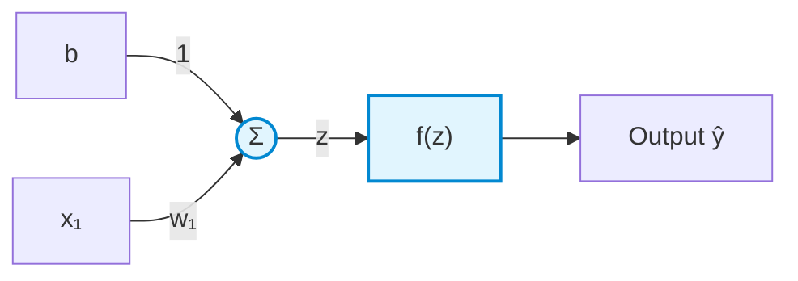
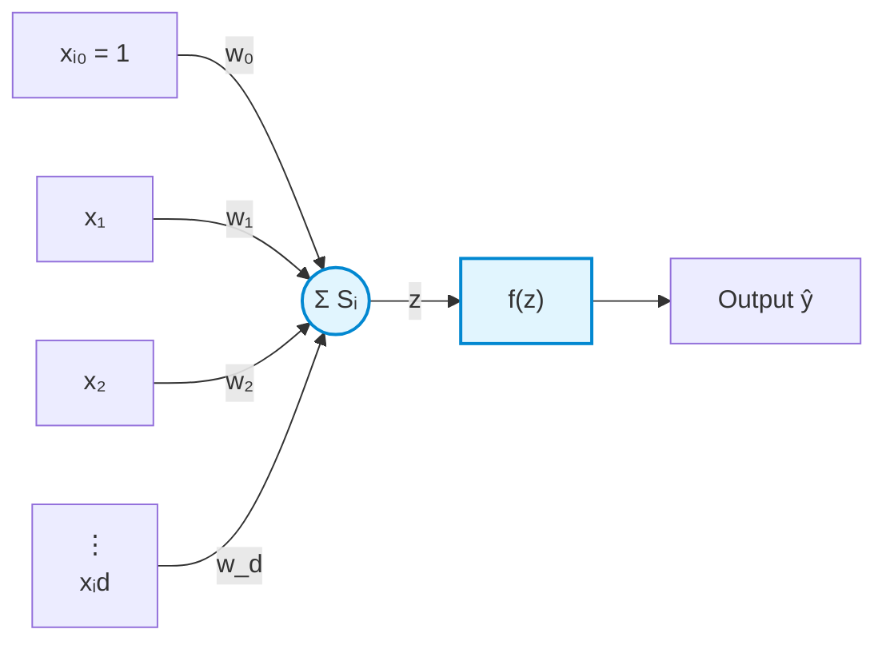

# The Perceptron

A **Perceptron** is the fundamental building block of artificial neural networks, functioning as an artificial mathematical model of a biological neuron designed for binary classification.

## 1. Architecture

### Single Input Perceptron

### Multi-Input Perceptron

## 2. Mathematical Formulation

For an input vector with $d$ features and a bias term $x_{i0} = 1$:

- **Weighted Sum ($z$ or $S_i$):**

$$z = S_i = \sum_{j=0}^{d} w_j x_{ij} = w_0 x_{i0} + w_1 x_{i1} + w_2 x_{i2} + \dots + w_d x_{id}$$

- **Output ($\hat{y}$):**

$$\hat{y} = f(z)$$

_where $f(z)$ is an activation function (e.g., Heaviside step function, signum)._

## 3. Biological Neuron vs. Perceptron

| Biological Neuron    | Artificial Perceptron            | Role / Description                                         |
| -------------------- | -------------------------------- | ---------------------------------------------------------- |
| **Dendrites**        | Inputs ($x_i$) & Weights ($w_i$) | Receive input signals and scale signal strength            |
| **Soma (Cell Body)** | Summation ($\sum$)               | Aggregates all incoming signals into a net input           |
| **Axon Hillock**     | Activation Threshold ($f(z)$)    | Determines if total potential triggers an action potential |
| **Axon / Synapses**  | Output ($\hat{y}$)               | Transmits the final signal to downstream units             |

## 4. Parameter Interpretation

- **Weights ($w$):** Quantify **feature importance**.
  - A large positive weight means the feature strongly votes in favor of the positive class.
  - A large negative weight means the feature strongly votes against the positive class.
  - A weight near zero indicates the feature has little to no influence.

- **Bias ($b$ or $w_0$):** Shifts the decision boundary away from the origin, allowing the model to fit data that does not cross $(0, 0)$.

## 5. Geometric Intuition

The condition $z = 0$ defines the **decision boundary**:

$$\sum_{j=0}^{d} w_j x_j = 0$$

- **2D Space:** A straight line separating two regions.
- **3D Space:** A flat 2D plane.
- **4D+ Space:** A hyperplane of dimension $d - 1$.

### Capabilities & Limitations

- **Binary Classifier:** Maps inputs to one of two categories based on which side of the hyperplane they fall on ($z > 0$ vs. $z \le 0$).
- **Linear Separability:** Can only classify data that is **linearly separable** (or approximately linear). It cannot solve non-linear problems (such as the XOR problem) without multi-layer networks (MLPs) or feature transformation.
