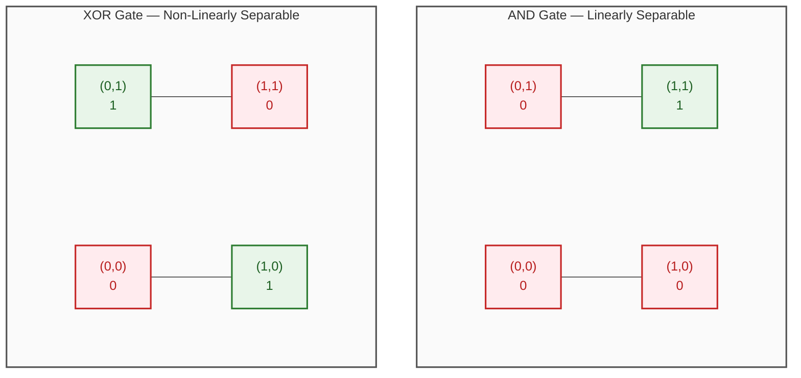

# Limitations of the Perceptron: The XOR Problem

The single-layer perceptron was historically considered a major breakthrough until Marvin Minsky and Seymour Papert (1969) proved its fundamental limitation: **a single perceptron can only learn linearly separable patterns**.

## 1. Linear vs. Non-Linear Separability

Logic gates provide the clearest illustration of this limitation:

| $x_1$ | $x_2$ | **AND** ($y$) | **OR** ($y$) | **XOR** ($y$) |
| :---: | :---: | :-----------: | :----------: | :-----------: |
|   0   |   0   |       0       |      0       |       0       |
|   0   |   1   |       0       |      1       |       1       |
|   1   |   0   |       0       |      1       |       1       |
|   1   |   1   |       1       |      1       |       0       |

- **AND & OR Gates:** The positive outputs (`1`) and negative outputs (`0`) can be separated by a single straight line ($w_1 x_1 + w_2 x_2 + w_0 = 0$). They are **linearly separable**.
- **XOR Gate:** Outputs `1` when inputs are different, and `0` when they are identical. No single straight line can separate the `(0, 1)` and `(1, 0)` points from `(0, 0)` and `(1, 1)`. It is **non-linearly separable**.

## 2. Geometric Intuition

A single perceptron finds a single linear boundary ($w_1 x_1 + w_2 x_2 + w_0 = 0$).



Because a single perceptron can only produce a **single linear hyperplane** as a decision boundary:

- A single perceptron **solves** AND and OR.
- A single perceptron **fails** on XOR.

## 3. Implementation in Python

### Dataset Setup

```python
import numpy as np
import pandas as pd
import matplotlib.pyplot as plt
import seaborn as sns
from sklearn.linear_model import Perceptron

# Define logic gate truth tables
and_data = pd.DataFrame({
    'input1': [1, 1, 0, 0],
    'input2': [1, 0, 1, 0],
    'output': [1, 0, 0, 0]
})

or_data = pd.DataFrame({
    'input1': [1, 1, 0, 0],
    'input2': [1, 0, 1, 0],
    'output': [1, 1, 1, 0]
})

xor_data = pd.DataFrame({
    'input1': [1, 1, 0, 0],
    'input2': [1, 0, 1, 0],
    'output': [0, 1, 1, 0]
})

```

### Fitting Perceptrons

```python
# Initialize models
clf_and = Perceptron()
clf_or  = Perceptron()
clf_xor = Perceptron()

# Train models
clf_and.fit(and_data[['input1', 'input2']], and_data['output'])
clf_or.fit(or_data[['input1', 'input2']], or_data['output'])
clf_xor.fit(xor_data[['input1', 'input2']], xor_data['output'])

# Check training accuracies
print("AND Accuracy:", clf_and.score(and_data[['input1', 'input2']], and_data['output']))  # 1.0 (100%)
print("OR  Accuracy:", clf_or.score(or_data[['input1', 'input2']], or_data['output']))    # 1.0 (100%)
print("XOR Accuracy:", clf_xor.score(xor_data[['input1', 'input2']], xor_data['output']))  # 0.5 (50% - fails)

```

### Plotting the Decision Boundary

The decision boundary equation is:

$$w_1 x_1 + w_2 x_2 + w_0 = 0 \implies x_2 = -\frac{w_1}{w_2} x_1 - \frac{w_0}{w_2}$$

```python
def plot_decision_boundary(clf, data, title):
    w1, w2 = clf.coef_[0]
    w0 = clf.intercept_[0]

    # Calculate slope (m) and intercept (c)
    m = -w1 / w2
    c = -w0 / w2

    x = np.linspace(-0.5, 1.5, 100)
    y = m * x + c

    plt.figure(figsize=(6, 5))
    plt.plot(x, y, 'r--', label='Decision Boundary')
    sns.scatterplot(data=data, x='input1', y='input2', hue='output', s=200, style='output')

    plt.xlim(-0.5, 1.5)
    plt.ylim(-0.5, 1.5)
    plt.title(title)
    plt.legend()
    plt.grid(True)
    plt.show()

# AND gate separates cleanly
plot_decision_boundary(clf_and, and_data, "AND Gate - Linearly Separable")

# XOR gate cannot be separated by a single line
plot_decision_boundary(clf_xor, xor_data, "XOR Gate - Fails with Single Line")

```

## 4. The Solution: Multi-Layer Perceptron (MLP)

To solve non-linear problems like XOR:

1. **Combine multiple perceptrons:** XOR can be decomposed into linearly separable logic gates:

$$\text{XOR}(x_1, x_2) = (x_1 \lor x_2) \land \neg(x_1 \land x_2)$$

2. **Hidden Layers:** Adding one or more hidden layers with non-linear activation functions allows the network to bend and carve non-linear decision boundaries.
3. This architecture is called a **Multi-Layer Perceptron (MLP)** or **Deep Neural Network**.
