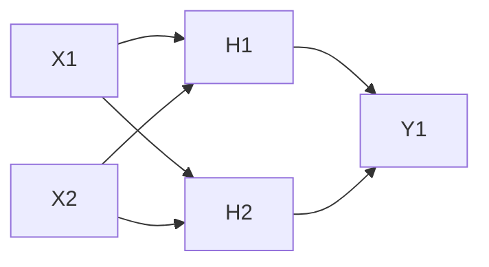
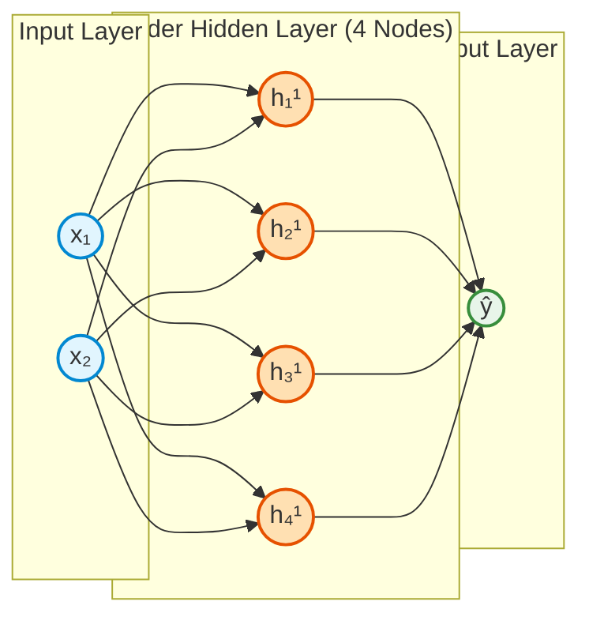
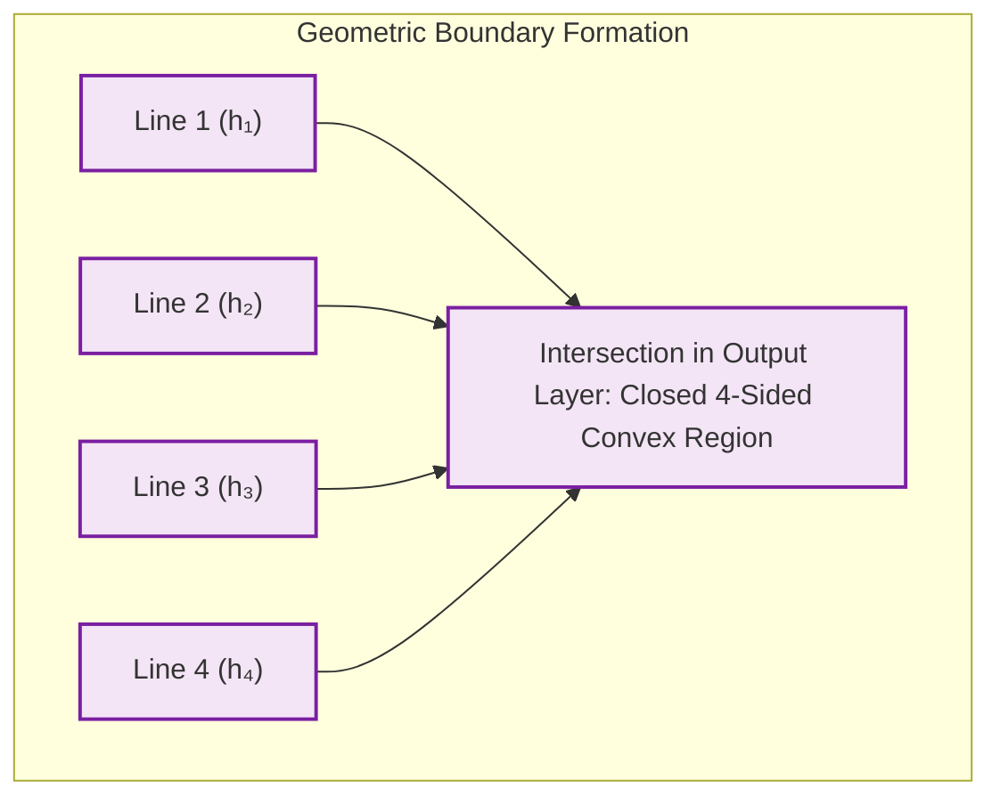
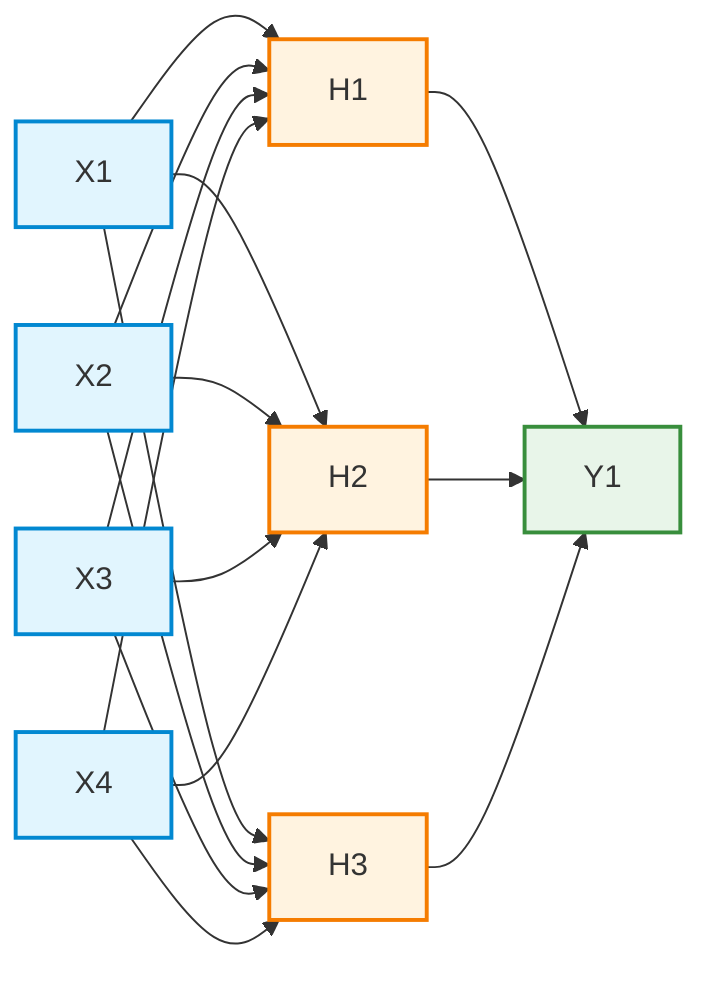
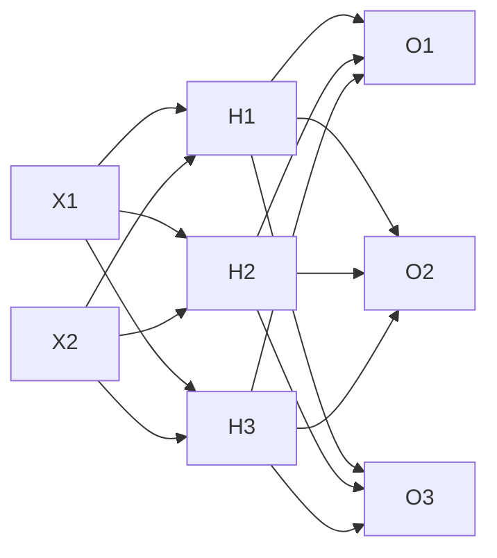
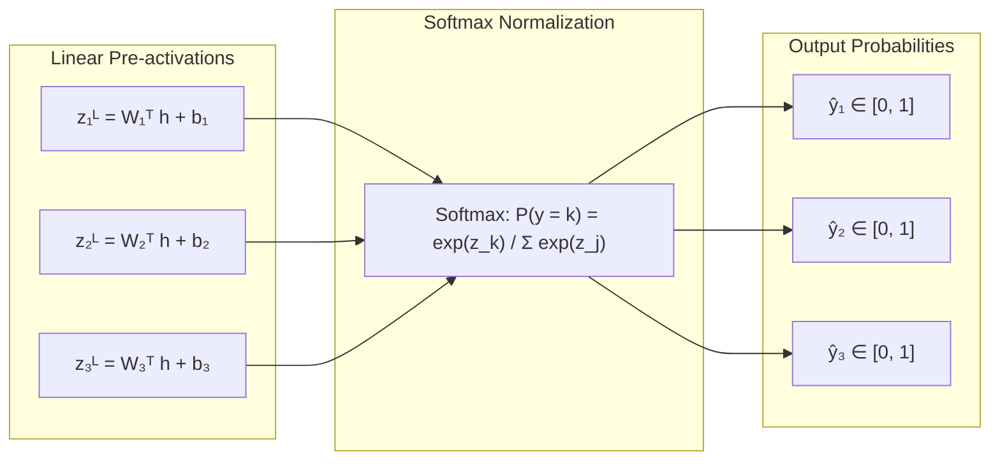
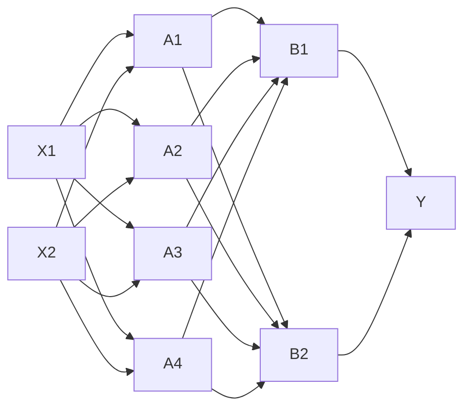
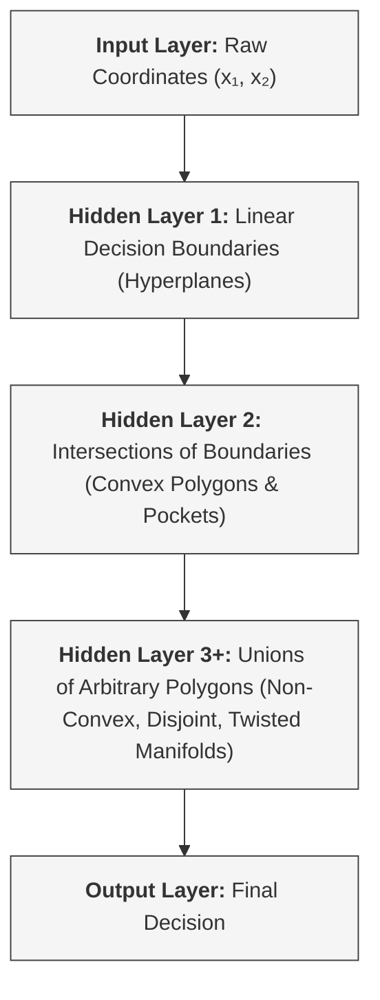

# Multi-Layer Perceptron (MLP) Intuition & Architectural Evolution

A Multi-Layer Perceptron (MLP) is a universal function approximator. Its architectural layout dictates what kinds of geometric transformations and decision boundaries it can construct.

## 1. The Baseline Network (Binary Classification with 2 Features)

Consider a baseline MLP: $2$ input features ($x_1, x_2$), one hidden layer with $2$ neurons(H1, H2), and $1$ output neuron[Y1] (binary classification).



### Geometric Intuition

- Each hidden neuron represents a single linear boundary (line) in 2D space:
- $h_1: w_{11}x_1 + w_{12}x_2 + b_1 = 0$
- $h_2: w_{21}x_1 + w_{22}x_2 + b_2 = 0$

- The output node combines these two linear regions. With only 2 lines, it can at best form an open angle or a single wedge.

```
       x₂ ▲
          │      / Line 1 (h₁)
          │     /
       ───┼────/─────────── Line 2 (h₂)
          │   /
          │  /  [Class 1 Region]
──────────┴─/────────────────► x₁

```

## 2. Structural Modification 1: Adding Nodes in Hidden Layer (Increasing Width)

Increasing the number of nodes in a hidden layer enhances the **expressive capacity within a single transformation step**.

### Architecture: Expanding Hidden Layer (e.g., from 2 to 4 Nodes)



### Geometric Intuition: Polygonal Enclosures

With $k$ neurons in a single hidden layer, the output layer can synthesize $k$ hyperplanes into a closed polygon with $k$ sides:



```
       x₂ ▲       / Line 1
          │     /   \ Line 2
          │   /       \
          │  │ Convex  │
          │   \ Region /
          │     \   /  Line 3
       ───┼───────V────────── Line 4
──────────┴──────────────────► x₁

```

- **Effect:** As $k \to \infty$, a single wide hidden layer can approximate any smooth closed convex boundary in $\mathbb{R}^d$ (**Universal Approximation Theorem**).
- **Risk:** Overfitting and high parameter count without hierarchical feature reuse.

## 3. Structural Modification 2: Adding Nodes in Input Layer (Handling New Features)

When additional data columns are acquired (e.g., expanding from tabular metrics $[x_1, x_2]$ to include $[x_3, x_4]$), the input dimensionality increases.

here,
X1(("x₁: Age"))  
X2(("x₂: Income"))  
X3(("x₃: Credit Score"))  
X4(("x₄: Debt Ratio"))

### Architecture: 4-Dimensional Feature Vector



### Geometric Intuition: Increasing Dimensionality

- The input space shifts from a 2D plane ($\mathbb{R}^2$) to a 4D space ($\mathbb{R}^4$).
- Each hidden neuron now cuts space with a **3D hyperplane** rather than a 2D line:

$$w_1 x_1 + w_2 x_2 + w_3 x_3 + w_4 x_4 + b = 0$$

- **Parameter scaling:** Every added input feature introduces $n^{[1]}$ new connections to the first hidden layer:

$$\Delta \text{Weights} = \Delta n^{[0]} \times n^{[1]}$$

## 4. Structural Modification 3: Adding Nodes in Output Layer (Multiclass Classification)

When moving beyond binary classification to $K$ distinct classes (e.g., Dog, Cat, Bird), the single scalar output is expanded into a $K$-dimensional probability distribution.

### Architecture: Multiclass Output Layer ($K = 3$) with Softmax



### Mathematical Mechanism



- **Boundary partitioning:** Instead of dividing space into two sides ($z \ge 0$ vs $z < 0$), the network creates $K$ distinct Voronoi-like decision regions where Class $k$ wins if $z_k > z_j \quad \forall j \neq k$.

## 5. Structural Modification 4: Adding More Hidden Layers (Increasing Depth)

Adding hidden layers transforms the network from a single-step partitioner into a **hierarchical feature extractor**.

### Architecture: Deep MLP (2 Hidden Layers)



### Depth vs. Geometric Complexity



## 6. Architectural Decision Matrix

| Modification                     | Primary Motivation                                          | Geometric Consequence                                          | Cost / Trade-off                                              |
| -------------------------------- | ----------------------------------------------------------- | -------------------------------------------------------------- | ------------------------------------------------------------- |
| **Add Input Nodes ($n^{[0]}$)**  | Incorporate new features/measurements.                      | Increases dimensionality of the input space ($\mathbb{R}^d$).  | Increases $W^{[1]}$ size; risks curse of dimensionality.      |
| **Add Hidden Nodes ($n^{[l]}$)** | Increase precision and number of linear cuts per layer.     | Allows higher-sided polygonal boundaries within the layer.     | Linear increase in parameters; risk of overfitting.           |
| **Add Hidden Layers ($L$)**      | Learn hierarchical abstractions and compositionality.       | Enables non-convex, nested, and disjoint decision regions.     | Vanishing/exploding gradients; harder optimization landscape. |
| **Add Output Nodes ($n^{[L]}$)** | Move from binary to multiclass classification / multi-task. | Partitions the final activation space into $K$ mutual regions. | Requires Softmax normalization and Categorical Cross-Entropy. |
