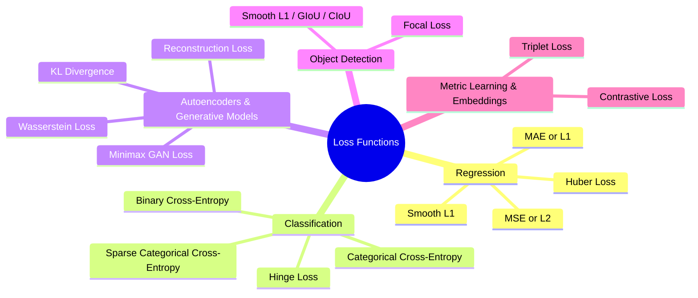
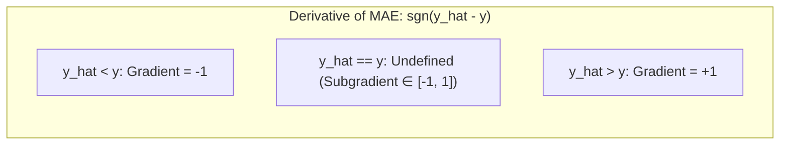

# Loss Functions in Deep Learning

A loss function quantifies model error, dictates gradient trajectory, and defines convergence behavior during optimization.

## 1. Foundational Concepts

### What is a Loss Function?

A **loss function** is a mathematical evaluation metric that measures the discrepancy between an algorithm's predicted output ($\hat{y}$) and the true target value ($y$) for a given set of model parameters $\mathbf{\theta}$:

$$\mathcal{L}(\mathbf{\theta}) = \ell(y, \hat{y})$$

During training, optimization algorithms (such as SGD or Adam) iteratively adjust $\mathbf{\theta}$ to minimize this value:

$$\mathbf{\theta}^* = \arg\min_{\mathbf{\theta}} \mathcal{L}(\mathbf{\theta})$$

### Why are Loss Functions Essential?

> _"You can't improve what you can't measure."_ — Peter Drucker

In deep learning, optimization cannot take place without a differentiable or sub-differentiable signal. The loss function transforms task performance into a smooth scalar landscape, allowing backpropagation to compute analytical gradients with respect to every weight and bias.

### Loss Function vs. Cost Function

| Dimension    | Loss Function $\ell(y^{(i)}, \hat{y}^{(i)})$ | Cost Function $J(\mathbf{\theta})$                                                                               |
| :----------- | :------------------------------------------- | :--------------------------------------------------------------------------------------------------------------- |
| **Scope**    | Evaluates a **single instance / sample**     | Aggregates error across a **batch or full dataset**                                                              |
| **Formula**  | $\ell(y^{(i)}, \hat{y}^{(i)})$               | $J(\mathbf{\theta}) = \frac{1}{m} \sum_{i=1}^{m} \ell(y^{(i)}, \hat{y}^{(i)}) + \lambda \Omega(\mathbf{\theta})$ |
| **Use Case** | Per-sample gradient tracking                 | Global step monitoring and parameter updates                                                                     |

## 2. Taxonomy of Loss Functions in Deep Learning



## 3. Regression Loss Functions

### A. Mean Squared Error (MSE / $L_2$ Loss)

MSE measures the average squared difference between true targets and predicted outputs.

#### Mathematical Formulation

- **Per-instance Loss:**

$$\ell_{\text{MSE}}(y_i, \hat{y}_i) = (y_i - \hat{y}_i)^2$$

- **Cost Function:**

$$J_{\text{MSE}}(\mathbf{\theta}) = \frac{1}{m} \sum_{i=1}^{m} (y_i - \hat{y}_i)^2$$

- **Compatible Output Activation:** **Linear / Identity** ($f(z) = z$)

#### Error Magnification Behavior

Because of its quadratic nature, error scales non-linearly:

- Absolute error $= 1 \implies \text{Loss} = 1^2 = 1$
- Absolute error $= 2 \implies \text{Loss} = 2^2 = 4$
- Absolute error $= 10 \implies \text{Loss} = 10^2 = 100$

Large errors generate large gradients, forcing the model to prioritize reducing extreme outliers.

#### Analytical Properties

- **Gradient:**

$$\frac{\partial J}{\partial \hat{y}_i} = -\frac{2}{m}(y_i - \hat{y}_i)$$

_(Gradient decays smoothly to zero as predictions approach targets, preventing oscillation around the minimum)._

#### Pros & Cons

- **Advantages:**
  - Strictly convex with a single global minimum for linear systems.
  - Smooth and infinitely differentiable everywhere.
  - Penalizes large errors heavily, which is desirable when extreme errors are dangerous.

- **Disadvantages:**
  - Highly sensitive to outliers; extreme anomalies pull the decision boundary away from the true distribution.
  - Error is measured in squared units ($unit^2$), making physical interpretation less intuitive.

### B. Mean Absolute Error (MAE / $L_1$ Loss)

MAE measures the average absolute linear distance between predictions and targets.

#### Mathematical Formulation

- **Per-instance Loss:**

$$\ell_{\text{MAE}}(y_i, \hat{y}_i) = |y_i - \hat{y}_i|$$

- **Cost Function:**

$$J_{\text{MAE}}(\mathbf{\theta}) = \frac{1}{m} \sum_{i=1}^{m} |y_i - \hat{y}_i|$$

- **Compatible Output Activation:** **Linear / Identity** ($f(z) = z$)

#### Error Scaling & Non-Differentiability

Unlike MSE, error penalty scales linearly. However, MAE is **non-differentiable at $(y_i - \hat{y}_i) = 0$**.



To optimize MAE, solvers must rely on **subgradient calculus**:

$$
\partial_{\hat{y}_i} |y_i - \hat{y}_i| =
\begin{cases}
-1, & \hat{y}_i < y_i \\
+1, & \hat{y}_i > y_i \\
[-1, 1], & \hat{y}_i = y_i
\end{cases}
$$

#### Pros & Cons

- **Advantages:**
  - Robust to outliers (median estimator rather than mean estimator).
  - Error scale matches the original measurement units ($unit$).

- **Disadvantages:**
  - Gradient magnitude remains constant ($\pm 1$) regardless of how small the error is, risking overshoot near the minimum unless learning rates are decayed.
  - Subgradient evaluation adds computational overhead.

### C. Huber Loss (Smooth Approximator)

Huber Loss combines the convergence speed of MSE for small errors with the outlier resistance of MAE for large errors, parameterized by threshold $\delta$.

#### Mathematical Formulation

- **Per-instance Loss:**

$$
\ell_{\delta}(y_i, \hat{y}_i) =
\begin{cases}
\frac{1}{2}(y_i - \hat{y}_i)^2, & \text{for } |y_i - \hat{y}_i| \le \delta \\[8pt]
\delta \cdot |y_i - \hat{y}_i| - \frac{1}{2}\delta^2, & \text{otherwise}
\end{cases}
$$

- **Cost Function:**

$$J_{\delta}(\mathbf{\theta}) = \frac{1}{m} \sum_{i=1}^{m} \ell_{\delta}(y_i, \hat{y}_i)$$

- **Compatible Output Activation:** **Linear / Identity** ($f(z) = z$)

#### Geometric Transition & Mechanism

- When error $|y_i - \hat{y}_i| \le \delta$: Functions as a quadratic curve (smoothly approaching 0 without overshoot).
- When error $|y_i - \hat{y}_i| > \delta$: Switches to a linear slope of $\delta$, preventing outliers from generating oversized gradients.
- The term $-\frac{1}{2}\delta^2$ ensures $C^1$ mathematical continuity (the curve and its first derivative are smooth across $\pm \delta$).

```
           Loss ▲
                │                   • MAE (Linear everywhere)
                │    \         /    • MSE (Quadratic everywhere)
                │     \  MSE  /     • Huber: MSE in [ -δ, δ ],
                │      \     /               MAE outside
                │  MAE  \_._/  MAE
                └────────┴──┴────────► (y - y_hat)
                        -δ   δ

```

## 4. Classification Loss Functions

### A. Binary Cross-Entropy (BCE / Log Loss)

BCE evaluates binary classification problems ($y \in \{0, 1\}$) by treating outputs as Bernoulli probabilities.

#### Mathematical Formulation

- **Per-instance Loss:**

$$\ell_{\text{BCE}}(y_i, \hat{y}_i) = - \left[ y_i \ln(\hat{y}_i) + (1 - y_i) \ln(1 - \hat{y}_i) \right]$$

- **Cost Function:**

$$J_{\text{BCE}}(\mathbf{\theta}) = -\frac{1}{m} \sum_{i=1}^{m} \left[ y_i \ln(\hat{y}_i) + (1 - y_i) \ln(1 - \hat{y}_i) \right]$$

- **Required Output Activation:** **Sigmoid**

$$\sigma(z) = \frac{1}{1 + e^{-z}} \implies \hat{y} \in (0, 1)$$

#### Mechanics & Penalty Behavior

- If true $y_i = 1$: Loss simplifies to $-\ln(\hat{y}_i)$. As $\hat{y}_i \to 1$, $\text{Loss} \to 0$. As $\hat{y}_i \to 0$, $\text{Loss} \to \infty$.
- If true $y_i = 0$: Loss simplifies to $-\ln(1 - \hat{y}_i)$. As $\hat{y}_i \to 0$, $\text{Loss} \to 0$. As $\hat{y}_i \to 1$, $\text{Loss} \to \infty$.

Confident, incorrect predictions incur asymptotic penalties.

#### Analytical Gradient Coupling

Pairing Sigmoid with BCE eliminates the vanishing gradient problem in linear layers:

$$\frac{\partial \ell_{\text{BCE}}}{\partial z} = \hat{y} - y$$

The update step is directly proportional to linear error, avoiding the derivative bottleneck $\sigma'(z)$.

### B. Categorical Cross-Entropy (CCE)

Used for multi-class classification where each sample belongs to exactly one of $K$ mutually exclusive categories ($K > 2$).

#### Mathematical Formulation

- **Target Representation:** One-hot encoded vector $\mathbf{y}_i \in \{0, 1\}^K$, where $\sum_{j=1}^{K} y_{ij} = 1$.
- **Per-instance Loss:**

$$\ell_{\text{CCE}}(\mathbf{y}_i, \mathbf{\hat{y}}_i) = -\sum_{j=1}^{K} y_{ij} \ln(\hat{y}_{ij})$$

_(Since only the true class label index $c$ has $y_{ic} = 1$, the loss reduces to $-\ln(\hat{y}_{ic})$).\_

- **Cost Function:**

$$J_{\text{CCE}}(\mathbf{\theta}) = -\frac{1}{m} \sum_{i=1}^{m} \sum_{j=1}^{K} y_{ij} \ln(\hat{y}_{ij})$$

- **Required Output Activation:** **Softmax**

$$\hat{y}_{ij} = \frac{e^{z_{ij}}}{\sum_{k=1}^{K} e^{z_{ik}}}$$

#### Gradient Coupling

Similar to Sigmoid with BCE, the Softmax-CCE pair simplifies analytically:

$$\frac{\partial \ell_{\text{CCE}}}{\partial z_{ij}} = \hat{y}_{ij} - y_{ij}$$

### C. Sparse Categorical Cross-Entropy (SCCE)

Sparse Categorical Cross-Entropy is mathematically identical to Categorical Cross-Entropy, but uses **integer class indices** instead of one-hot encoded vectors.

#### Mathematical Formulation

- **Target Representation:** Integer scalar label $y_i \in \{0, 1, \dots, K-1\}$.
- **Per-instance Loss:**

$$\ell_{\text{SCCE}}(y_i, \mathbf{\hat{y}}_i) = -\ln\left(\hat{y}_{i, y_i}\right)$$

_(Selects the predicted probability matching the true class index $y_i$)._

- **Cost Function:**

$$J_{\text{SCCE}}(\mathbf{\theta}) = -\frac{1}{m} \sum_{i=1}^{m} \ln\left(\hat{y}_{i, y_i}\right)$$

- **Required Output Activation:** **Softmax**

#### CCE vs. SCCE Trade-offs

| Criterion            | Categorical Cross-Entropy (CCE)                            | Sparse Categorical Cross-Entropy (SCCE)            |
| -------------------- | ---------------------------------------------------------- | -------------------------------------------------- |
| **Label Format**     | One-hot vector (e.g., `[0, 0, 1, 0]`)                      | Integer scalar (e.g., `2`)                         |
| **Memory Footprint** | $\mathcal{O}(m \times K)$ (Memory-heavy when $K$ is large) | $\mathcal{O}(m)$ (Highly compact)                  |
| **Label Smoothing**  | Trivially supported (soft probabilities)                   | Requires custom target transformation              |
| **Use Case**         | Multi-label tasks or moderate class sizes                  | Large vocabularies (e.g., NLP with 50,000+ tokens) |

## 5. Architectural Reference: Matching Task, Activation, and Loss

| Task Type                                      | Target Format                        | Final Layer Activation      | Loss Function                              |
| ---------------------------------------------- | ------------------------------------ | --------------------------- | ------------------------------------------ |
| **Regression (Standard)**                      | Continuous ($\mathbb{R}$)            | Linear / Identity           | Mean Squared Error (MSE)                   |
| **Regression (Outlier-Heavy)**                 | Continuous ($\mathbb{R}$)            | Linear / Identity           | Huber Loss or MAE                          |
| **Binary Classification**                      | Binary $\{0, 1\}$                    | Sigmoid                     | Binary Cross-Entropy                       |
| **Multi-Class (Mutually Exclusive)**           | One-hot encoded ($\{0, 1\}^K$)       | Softmax                     | Categorical Cross-Entropy                  |
| **Multi-Class (Mutually Exclusive, High $K$)** | Integer class index ($\mathbb{Z}^+$) | Softmax                     | Sparse Categorical Cross-Entropy           |
| **Multi-Label (Non-Exclusive)**                | Multi-hot binary vector              | Sigmoid (per output neuron) | Binary Cross-Entropy (summed over classes) |
